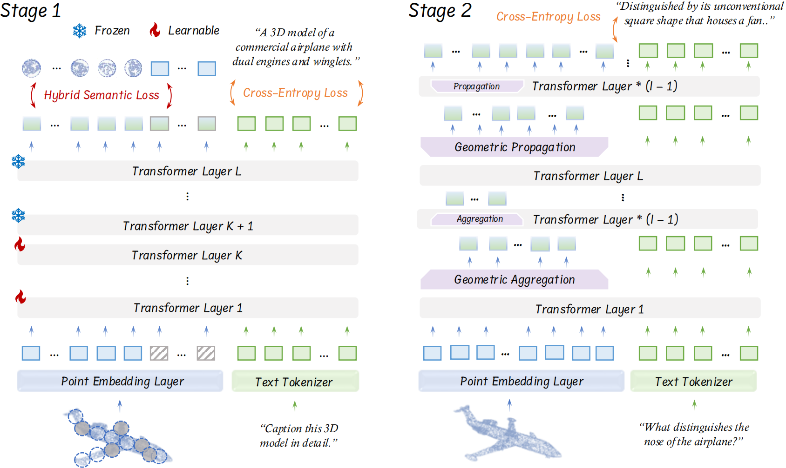

 

<h1 align="center"><strong>ENEL: Exploring the Potential of Encoder-free Architectures in 3D LMMs</strong></h1>
  

    <a target='_blank'>Yiwen Tang*</a>&emsp;
    <a target='_blank'>Zoey Guo*</a>&emsp;
    <a target='_blank'>Zhuhao Wang*</a>&emsp;
    <a target='_blank'>Ray Zhang*</a>&emsp;
    <a target='_blank'>Qizhi Chen</a>&emsp;
    <a target='_blank'>Junli Liu</a>&emsp;
    <a target='_blank'>Delin Qu</a>&emsp;
    <a target='_blank'>Zhigang Wang</a>&emsp;
    <a target='_blank'>Dong Wang</a>&emsp;
    <a target='_blank'>Bin Zhao</a>&emsp;
    <a target='_blank'>Xuelong Li</a>&emsp;
     
    Shanghai AI Laboratory&emsp;The Chinese University of Hong Kong&emsp;Tsinghua University&emsp;Northwestern Polytechnical University;
  

## 🏠 About
<!--  -->

    

We introduce <b>ENEL, a multi-modal large language model capable of understanding colored point clouds of objects.</b> It perceives object types, geometric structures, and appearance without concerns for ambiguous depth, occlusion, or viewpoint dependency. <b>We collect a novel dataset comprising 660K simple and 70K complex point-text instruction pairs</b> to enable a two-stage training strategy. To rigorously evaluate our model's perceptual abilities and its generalization capabilities, <b>we establish two benchmarks: Generative 3D Object Classification and 3D Object Captioning, assessed through three different evaluation methods.</b>
We introduce <b>ENEL, an Encoder-free 3D Large Language Model capable of overcoming the challenges posed by encoder-based architectures</b>, including the inability to <b>adapt to varying point cloud resolutions</b> and the failure of encoder-extracted point features to <b>meet the semantic needs of Large Language Models</b>. Building upon PointLLM, we conduct a comprehensive investigation into how <b>the LLM can assume the role of the 3D encoder</b>. Based on the PointLLM dataset, our 7B model is evaluated across <b>three benchmark tasks: generative 3D object classification, 3D object captioning, and 3D VQA, with assessments performed using GPT-4 scoring and traditional metrics.</b>

## 🔥 News
- [2023-02-13] We release the codes for training in the pre-training stage with corresponding checkpoints and the codes for model evaluation, including GPT-4 evaluation and traditional metric evaluation.
- [2025-02-13] We release the [paper]() of ENEL;

<!-- contents with emoji -->
## 📋 Contents
- [💬 Dialogue Examples](#-dialogue-examples)
- [🔍 Overview](#-overview)
- [📦 Training and Evaluation](#-training-and-evaluation)
- [📝 TODO List](#-todo-list)
- [🔗 Citation](#-citation)
- [📄 License](#-license)
- [📚 Related Work](#-related-work)
- [👏 Acknowledgements](#-acknowledgements)

## 💬 Dialogue Examples
| Dialogue 1 
| :-: | 
|  |

## 🔍 Overview

### Model

  

The encoder-free 3D LMM directly utilizes a token embedding module to convert point cloud data into discrete point tokens, which are then concatenated with text tokens to serve as input to the LLM. To assume the role of the encoder, the LLM is guided to extract high-level semantic features of the point clouds and acquire multi-level knowledge from both global and local perspectives. 

### Experiment Results
#### Quantitative Comparisons with baselines.
