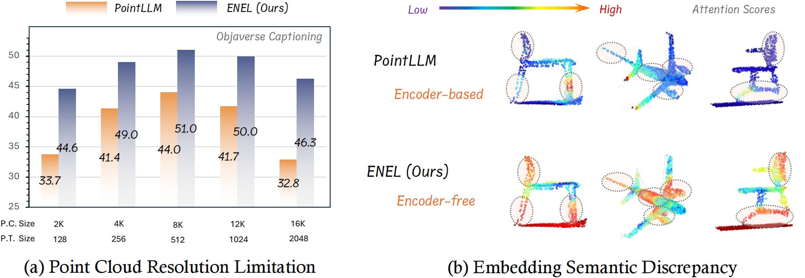

# Exploring the Potential of Encoder-free Architectures in 3D LMMs

Official repository for the paper "[Exploring the Potential of Encoder-free Architectures in 3D LMMs](https://arxiv.org/pdf/2502.09620v1)".

[[📖 Paper](https://arxiv.org/pdf/2502.09620v1)] [[🤗 HF Checkpoints for stage1](https://huggingface.co/IvanTang/ENEL/tree/main)] 

## 🏠 About
<!--  -->
<div style="text-align: center;">
    
</div>
We introduce <b>ENEL, an Encoder-free 3D Large Language Model capable of overcoming the challenges posed by encoder-based architectures</b>, including the inability to <b>adapt to varying point cloud resolutions</b> and the failure of encoder-extracted point features to <b>meet the semantic needs of Large Language Models</b>. Building upon PointLLM, we conduct a comprehensive investigation into how <b>the LLM can assume the role of the 3D encoder</b>. Based on the PointLLM dataset, our 7B model is evaluated across <b>three benchmark tasks: generative 3D object classification, 3D object captioning, and 3D VQA, with assessments performed using GPT-4 scoring and traditional metrics.</b>

## 🔥 News
- [2023-02-13] We release the codes for training in the pre-training stage with corresponding checkpoints and the codes for evaluation.
- [2025-02-13] We release the [paper](https://arxiv.org/pdf/2502.09620v1) of ENEL;

<!-- contents with emoji -->
## 📋 Contents
- [💬 Dialogue Examples](#-dialogue-examples)
- [🔍 Overview](#-overview)
- [📦 Training and Evaluation](#-training-and-evaluation)
- [📝 TODO List](#-todo-list)
- [🔗 Citation](#-citation)
- [📄 License](#-license)
- [📚 Related Work](#-related-work)


## 💬 Dialogue Examples
| Dialogue 1 
| :-: | 
|  |


## 🔍 Overview

### Model
<p align="center">
  
</p>
The encoder-free 3D LMM directly utilizes a token embedding module to convert point cloud data into discrete point tokens, which are then concatenated with text tokens to serve as input to the LLM. To assume the role of the encoder, the LLM is guided to extract high-level semantic features of the point clouds and acquire multi-level knowledge from both global and local perspectives. 

### Experiment Results
Please refer to our paper for more results.
<p align="center">
  
</p>

### Reminder of the Model Zoo
In [https://huggingface.co/IvanTang/ENEL/tree/main](https://huggingface.co/IvanTang/ENEL/tree/main), to adapt to different paths, please modify the attributes: _name_or_path in the config.json file and special_tokens_map_file in the tokenizer_config.json file.


## 📦 Training and Evaluation
### Installation
To start: 
1. Clone this repository.
```bash
https://github.com/Ivan-Tang-3D/ENEL.git
cd ENEL
```
2. Install packages
```bash
conda create -n ENEL python=3.10 -y
conda activate ENEL
pip install --upgrade pip  # enable PEP 660 support
pip install -e .

# * for training
pip install ninja
pip install flash-attn

# * for chamfer_dist
git clone https://github.com/Pang-Yatian/Point-MAE.git
cd ./extensions/chamfer_dist
python setup.py install --user
```

### Data Preparation
#### Objaverse Training Data
1. Download the two compressed files of 660K Objaverse colored point clouds [here](https://huggingface.co/datasets/RunsenXu/PointLLM/tree/main). They require about 77GB of storage space.
2. Run the following command to merge the two files into one and uncompress it. This will produce a folder named `8192_npy` containing 660K point cloud files named `{Objaverse_ID}_8192.npy`. Each file is a numpy array with dimensions (8192, 6), where the first three dimensions are `xyz` and the last three dimensions are `rgb` in [0, 1] range.
```bash
cat Objaverse_660K_8192_npy_split_a* > Objaverse_660K_8192_npy.tar.gz
tar -xvf Objaverse_660K_8192_npy.tar.gz
```
3. In `ENEL` folder, create a folder `data` and create a soft link to the uncompressed file in the directory.
```bash
cd ENEL
mkdir data
ln -s /path/to/8192_npy data/objaverse_data
```

#### Instruction-Following Data
1. In `ENEL/data` folder, create a directory named `anno_data`.
2. Our instruction-following data, including both the simple-description and complex instructions, can be downloaded [here](https://huggingface.co/datasets/RunsenXu/PointLLM). If you have difficulty downloading the data (e.g. network issue), please email the authors.
- The simple-description data has 660K samples and the complex instructions have 70K samples.
- Both training data are based on the Objaverse dataset.
- The complex instructions are generated with GPT-4.
3. Put the data files in the `anno_data` directory. The directory should look like this:
```bash
ENEL/data/anno_data
├── PointLLM_brief_description_660K_filtered.json
├── PointLLM_brief_description_660K.json
└── PointLLM_complex_instruction_70K.json
```
4. Note, the `PointLLM_brief_description_660K_filtered.json` is filtered from `PointLLM_brief_description_660K.json` by removing the 3000 objects we reserved as the validation set. 

#### Evaluation Data
1. Download the referencing GT `PointLLM_brief_description_val_200_GT.json` we use for the benchmarks on Objaverse dataset [here](https://huggingface.co/datasets/RunsenXu/PointLLM/blob/main/PointLLM_brief_description_val_200_GT.json), and put it in `ENEL/data/anno_data`.

### Training
#### Download the Initial LLM Weight
1. In `ENEL` folder, create a directory named `checkpoints`.
2. Download the pre-trained LLM: [
PointLLM_7B_v1.1_init](https://huggingface.co/RunsenXu/PointLLM_7B_v1.1_init/tree/main). Put them in the `checkpoints` directory.

#### Start Training
1. For stage-1 training, simply run:
```bash
cd ENEL
scripts/ENEL_train_stage1.sh
```
2. After stage-1 training, start stage-2 training:
```bash
scripts/ENEL_train_stage2.sh
```

### Evaluation
#### Inferencing & ChatGPT/GPT-4 Evaluation & Traditional Metric Evaluation
1. For inference, please download weights from Model Zoo: [https://huggingface.co/IvanTang/ENEL/tree/main](https://huggingface.co/IvanTang/ENEL/tree/main)
2. Get your OpenAI API key at [https://platform.openai.com/api-keys](https://platform.openai.com/api-keys).
3. Run the following commands to infer the results and evaluate.
4. Different commands for inferencing and evaluating on different benchmarks:
```bash
cd ENEL
bash scripts/eval.sh
```
5. The GPT-4 evaluation results will be saved in `{model_name}/evaluation` as another dict. For the object captioning task, the traditional metrics include BLEU, ROUGE, METEOR, Sentence-BERT, and SimCSE.

## 📝 TODO List
- [x] Add training codes for stage1 with checkpoints.
- [x] Add evaluation&inferencing codes.
- [ ] Add training codes for stage2.

## 🔗 Citation

If you find our work and this codebase helpful, please consider starring this repo 🌟 and cite.


## 📄 License
<a rel="license" href="http://creativecommons.org/licenses/by-nc-sa/4.0/"></a>
This work is under the <a rel="license" href="http://creativecommons.org/licenses/by-nc-sa/4.0/">Creative Commons Attribution-NonCommercial-ShareAlike 4.0 International License</a>.

## 📚 Related Work
Together, Let's make LLM for 3D great!
- [Point-Bind & Point-LLM](https://arxiv.org/abs/2309.00615)
- [PointLLM](https://arxiv.org/abs/2308.16911)
- [ShapeLLM](https://arxiv.org/abs/2402.17766)
